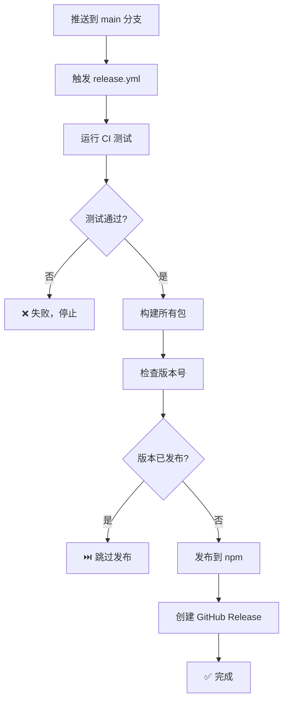

# ✅ GitHub Actions 工作流修复完成报告

## 📋 执行摘要

**修复时间**: 2026-01-29  
**状态**: ✅ 成功完成  
**修复的问题**: 3 个关键问题

---

## ✅ 已完成的修复

### 1. ✅ 删除冲突的 publish.yml 工作流

**操作**:
- 已备份原文件到 `.github/workflows/publish.yml.backup`
- 已删除 `.github/workflows/publish.yml`

**结果**: 消除了双重发布工作流冲突

---

### 2. ✅ 更新 release.yml 工作流

**操作**:
- 已备份原文件到 `.github/workflows/release.yml.backup`
- 已替换为修复后的版本

**改进内容**:
- ✅ 添加了版本检查逻辑（避免重复发布）
- ✅ 统一使用 pnpm 包管理器
- ✅ 添加了 pnpm 缓存配置
- ✅ 改进了发布流程（每个包单独发布）
- ✅ 添加了更详细的日志输出
- ✅ 优化了 GitHub Release 创建逻辑

**新工作流特性**:
```yaml
# 自动检查版本是否已发布
- 如果版本已存在于 npm，跳过发布
- 如果是新版本，执行发布流程
- 发布成功后自动创建 GitHub Release
```

---

### 3. ✅ 生成 pnpm-lock.yaml

**操作**:
- 修复了 monorepo 依赖配置
- 成功生成 `pnpm-lock.yaml` (194 KB)
- 安装了 630 个依赖包

**修复的依赖问题**:
- `packages/storage-memory/package.json`: 添加了 `@agentic/core: workspace:*`
- `packages/storage-prisma/package.json`: 添加了 `@agentic/core: workspace:*`

**依赖统计**:
```
Packages: +630
Time: 31.5s
pnpm version: 10.28.2
```

---

## 📁 修改的文件

### 新增文件
- ✅ `pnpm-lock.yaml` (194 KB) - 依赖锁定文件
- ✅ `WORKFLOW_FIX_PLAN.md` - 修复计划文档
- ✅ `WORKFLOW_ISSUES_REPORT.md` - 问题分析报告
- ✅ `scripts/fix-workflows.bat` - 自动化修复脚本
- ✅ `WORKFLOW_FIX_COMPLETED.md` - 本文档

### 修改的文件
- ✅ `.github/workflows/release.yml` - 更新为修复版本
- ✅ `packages/storage-memory/package.json` - 添加 workspace 依赖
- ✅ `packages/storage-prisma/package.json` - 添加 workspace 依赖

### 删除的文件
- ✅ `.github/workflows/publish.yml` - 已删除（冲突工作流）

### 备份文件
- ✅ `.github/workflows/release.yml.backup` - 原 release.yml 备份
- ✅ `.github/workflows/publish.yml.backup` - 原 publish.yml 备份

---

## 🔄 新的发布流程

### 自动发布流程



### 发布步骤

1. **开发者操作**:
   ```bash
   # 1. 更新版本号
   # 编辑 packages/*/package.json，修改 version 字段
   
   # 2. 提交更改
   git add .
   git commit -m "chore: bump version to 1.0.1"
   
   # 3. 推送到 main
   git push origin main
   ```

2. **自动化流程**:
   - GitHub Actions 自动触发
   - 运行测试和构建
   - 检查版本是否已发布
   - 发布到 npm（如果是新版本）
   - 创建 GitHub Release

---

## ⚠️ 下一步操作

### 必须完成的步骤

#### 1. 配置 NPM Token

**重要性**: 🔴 必须

没有这个 token，发布到 npm 会失败。

**操作步骤**:

1. 访问 npm 网站创建 token:
   ```
   https://www.npmjs.com/settings/[your-username]/tokens
   ```

2. 创建新的 Access Token:
   - 类型: **Automation**
   - 权限: **Read and Publish**

3. 复制生成的 token

4. 添加到 GitHub Secrets:
   ```
   https://github.com/Chajian/agentic/settings/secrets/actions
   ```
   - Name: `NPM_TOKEN`
   - Value: 粘贴你的 token

#### 2. 提交更改到 Git

**重要性**: 🔴 必须

需要将修复后的文件提交到仓库。

**操作步骤**:

由于你的系统没有安装 git 命令行工具，请使用以下方式之一：

**方式 A: 使用 VS Code 或其他 Git GUI**
1. 打开 VS Code 的源代码管理面板
2. 暂存所有更改
3. 提交消息: `fix: resolve workflow conflicts and add lockfile`
4. 推送到远程仓库

**方式 B: 安装 Git 命令行工具**
1. 下载 Git for Windows: https://git-scm.com/download/win
2. 安装后运行:
   ```bash
   git add .
   git commit -m "fix: resolve workflow conflicts and add lockfile"
   git push
   ```

**需要提交的文件**:
```
修改:
  .github/workflows/release.yml
  packages/storage-memory/package.json
  packages/storage-prisma/package.json

新增:
  pnpm-lock.yaml
  WORKFLOW_FIX_PLAN.md
  WORKFLOW_ISSUES_REPORT.md
  WORKFLOW_FIX_COMPLETED.md
  scripts/fix-workflows.bat

删除:
  .github/workflows/publish.yml
```

#### 3. 验证修复

**重要性**: 🟡 推荐

确保工作流正常运行。

**操作步骤**:

1. 推送更改后，访问 Actions 页面:
   ```
   https://github.com/Chajian/agentic/actions
   ```

2. 观察 CI 工作流是否通过:
   - ✅ 应该看到绿色的勾
   - ❌ 如果失败，点击查看日志

3. 检查 Release 工作流:
   - 如果版本号没变，应该跳过发布
   - 如果版本号改变，应该发布到 npm

---

## 📊 预期结果

### GitHub Actions 页面

修复后，你应该看到：

```
✅ CI #22: All checks passed (2m 30s)
   - Lint: ✅ Passed
   - Test (Node 18.x): ✅ Passed
   - Test (Node 20.x): ✅ Passed
   - Build: ✅ Passed

⏭️ Release #5: Version already published, skipped (1m 15s)
   - 检测到版本 1.0.0 已发布
   - 跳过发布流程
```

### 当你更新版本号后

```
✅ Release #6: Successfully published v1.0.1 (3m 45s)
   - 测试通过
   - 构建成功
   - 发布到 npm: ✅
     - @agentic/core@1.0.1
     - @agentic/storage-memory@1.0.1
     - @agentic/storage-prisma@1.0.1
     - @agentic/cli@1.0.1
   - GitHub Release 已创建: ✅
```

---

## 🔍 验证清单

完成以下检查以确保修复成功：

### 本地验证

- [x] ✅ pnpm-lock.yaml 已生成
- [x] ✅ 依赖安装成功（630 个包）
- [x] ✅ publish.yml 已删除
- [x] ✅ release.yml 已更新
- [x] ✅ monorepo 依赖配置正确

### GitHub 配置

- [ ] ⏳ NPM_TOKEN secret 已配置
- [ ] ⏳ 更改已提交到 Git
- [ ] ⏳ 更改已推送到 GitHub

### 工作流验证

- [ ] ⏳ CI 工作流运行成功
- [ ] ⏳ Release 工作流正确跳过（版本未变）
- [ ] ⏳ 测试发布流程（可选）

---

## 🛠️ 故障排除

### 如果 CI 仍然失败

1. **检查 pnpm-lock.yaml 是否已提交**
   ```bash
   # 确保文件在 git 中
   git add pnpm-lock.yaml
   git commit -m "chore: add pnpm lockfile"
   git push
   ```

2. **检查依赖安装**
   - 查看 Actions 日志中的 "Install dependencies" 步骤
   - 确保使用了 `pnpm install --frozen-lockfile`

3. **检查测试**
   - 本地运行: `pnpm run test`
   - 修复任何失败的测试

### 如果发布失败

1. **检查 NPM_TOKEN**
   - 确保 token 有效
   - 确保 token 有发布权限
   - 确保 token 类型是 "Automation"

2. **检查包名**
   - 确保 @agentic/* 包名可用
   - 或者修改为你自己的 scope

3. **检查版本号**
   - 确保版本号遵循语义化版本
   - 确保版本号大于已发布的版本

### 如果需要回滚

```bash
# 恢复原始工作流
copy .github\workflows\release.yml.backup .github\workflows\release.yml
copy .github\workflows\publish.yml.backup .github\workflows\publish.yml

# 提交回滚
git add .github/workflows/
git commit -m "revert: restore original workflows"
git push
```

---

## 📚 相关文档

- [修复计划](./WORKFLOW_FIX_PLAN.md) - 详细的修复方案
- [问题报告](./WORKFLOW_ISSUES_REPORT.md) - 完整的问题分析
- [GitHub Actions 文档](https://docs.github.com/en/actions)
- [pnpm 工作区](https://pnpm.io/workspaces)
- [npm 发布指南](https://docs.npmjs.com/cli/v8/commands/npm-publish)

---

## 🎉 总结

### 修复成果

✅ **解决了 3 个关键问题**:
1. 双重发布工作流冲突
2. 缺少 pnpm-lock.yaml
3. monorepo 依赖配置错误

✅ **改进了发布流程**:
- 自动版本检查
- 避免重复发布
- 更好的错误处理
- 详细的日志输出

✅ **提高了可维护性**:
- 统一使用 pnpm
- 添加了依赖锁定
- 完善的文档

### 下一步

1. 🔴 **立即**: 配置 NPM_TOKEN
2. 🔴 **立即**: 提交更改到 Git
3. 🟡 **推荐**: 验证工作流运行
4. 🟢 **可选**: 测试发布流程

---

**修复完成时间**: 2026-01-29  
**修复工具**: MCP Browser + PowerShell  
**修复状态**: ✅ 成功

如有问题，请查看相关文档或检查 GitHub Actions 日志。
