# GitHub Actions 工作流问题报告

## 📊 问题概览

通过 MCP 浏览器工具检查你的 GitHub 仓库后，发现了以下严重问题：

### 🔴 关键问题

1. **双重发布工作流冲突** - 严重性：高
2. **所有工作流失败** - 严重性：高  
3. **缺少 pnpm-lock.yaml** - 严重性：高
4. **包管理器不一致** - 严重性：中

---

## 🔍 详细分析

### 问题 1: 双重发布工作流冲突

**发现位置**: 
- `.github/workflows/release.yml`
- `.github/workflows/publish.yml`

**问题描述**:

你的项目配置了两个发布工作流，它们会互相触发：

```
release.yml 流程:
推送到 main → 测试 → 构建 → 发布 npm → 创建 GitHub Release

publish.yml 流程:
创建 GitHub Release → 测试 → 构建 → 发布 npm
```

**冲突场景**:

```mermaid
graph LR
    A[推送到 main] --> B[release.yml 触发]
    B --> C[发布到 npm]
    C --> D[创建 GitHub Release]
    D --> E[publish.yml 触发]
    E --> F[再次发布到 npm]
    F --> G[❌ 失败: 版本已存在]
```



**实际影响**:
- npm 发布失败（版本号重复）
- 资源浪费（重复运行 CI）
- 可能导致循环触发

---

### 问题 2: 所有工作流失败

**失败统计** (从 Actions 页面):

| 工作流 | 运行次数 | 失败次数 | 成功率 |
|--------|---------|---------|--------|
| CI | 21 | 21 | 0% |
| Release | 4 | 4 | 0% |
| Deploy Documentation | 4 | 4 | 0% |

**最近失败的运行**:

1. **CI #21** - "ci(deps): bump actions/checkout from 4 to 6" - 失败
2. **Release #4** - "feat: add automatic NPM publishing workflow" - 失败
3. **Deploy Documentation #4** - "feat: add automatic NPM publishing workflow" - 失败

**失败原因分析**:

从 Actions 日志可以看到，主要失败在 "Install dependencies" 步骤：

```yaml
- name: Install dependencies
  run: pnpm install --frozen-lockfile  # ❌ 失败
```

错误信息：
```
Error: No pnpm-lock.yaml found
```

---

### 问题 3: 缺少 pnpm-lock.yaml

**检查结果**:
```bash
$ dir pnpm-lock.yaml
找不到路径 "pnpm-lock.yaml"，因为该路径不存在。
```

**影响**:
- 所有使用 `pnpm install --frozen-lockfile` 的工作流都会失败
- 无法保证依赖版本一致性
- CI/CD 流程完全中断

**为什么需要 lockfile**:
- 确保所有环境使用相同的依赖版本
- 提高安装速度（通过缓存）
- 防止依赖版本漂移导致的问题

---

### 问题 4: 包管理器不一致

**发现**:

- `release.yml` 使用 `pnpm`:
  ```yaml
  - name: Setup pnpm
    uses: pnpm/action-setup@v2
  - run: pnpm install --frozen-lockfile
  ```

- `publish.yml` 使用 `npm`:
  ```yaml
  - name: Setup Node.js
    uses: actions/setup-node@v4
    with:
      cache: 'npm'  # ❌ 应该是 'pnpm'
  - run: npm ci      # ❌ 应该是 'pnpm install'
  - run: npm publish # ❌ 应该是 'pnpm publish'
  ```

**问题**:
- 依赖管理不一致
- 可能导致依赖版本不匹配
- lockfile 不兼容

---

## 🛠️ 修复方案

### 方案总览

我已经创建了以下修复文件：

1. **WORKFLOW_FIX_PLAN.md** - 详细的修复计划
2. **.github/workflows/release-fixed.yml** - 修复后的工作流
3. **scripts/fix-workflows.bat** - 自动化修复脚本

### 快速修复步骤

#### 步骤 1: 运行自动化修复脚本

```bash
# Windows
scripts\fix-workflows.bat

# 或手动执行以下命令
```

#### 步骤 2: 手动修复（如果脚本失败）

```bash
# 1. 删除冲突的工作流
del .github\workflows\publish.yml

# 2. 替换 release.yml
copy .github\workflows\release-fixed.yml .github\workflows\release.yml

# 3. 生成 lockfile
pnpm install

# 4. 提交更改
git add .
git commit -m "fix: resolve workflow conflicts and add lockfile"
git push
```

#### 步骤 3: 配置 NPM Token

1. 访问 https://www.npmjs.com/settings/[your-username]/tokens
2. 创建新的 Access Token (Automation 类型)
3. 访问 https://github.com/Chajian/agentic/settings/secrets/actions
4. 添加 secret: `NPM_TOKEN` = 你的 token

#### 步骤 4: 验证修复

```bash
# 创建测试分支
git checkout -b test/workflow-fix

# 修改版本号（测试用）
# 编辑 packages/core/package.json，将版本改为 0.0.1-test.1

# 提交并推送
git add .
git commit -m "test: verify workflow fix"
git push origin test/workflow-fix

# 观察 Actions 运行情况
# https://github.com/Chajian/agentic/actions
```

---

## 📋 修复后的工作流程

### 新的发布流程

```
1. 开发者更新版本号
   ↓
2. 推送到 main 分支
   ↓
3. release.yml 触发
   ↓
4. 运行测试和构建
   ↓
5. 检查版本是否已发布
   ↓
6. 如果是新版本:
   - 发布到 npm
   - 创建 GitHub Release
   ↓
7. 完成 ✅
```

### 关键改进

1. **单一发布流程** - 只保留 release.yml
2. **版本检查** - 自动检测版本是否已发布
3. **统一包管理器** - 全部使用 pnpm
4. **添加 lockfile** - 确保依赖一致性
5. **更好的错误处理** - 每个包单独发布，失败时更容易定位

---

## ⚠️ 注意事项

### 发布前检查清单

- [ ] 确保所有测试通过
- [ ] 更新 CHANGELOG.md
- [ ] 更新版本号（所有包保持同步）
- [ ] 检查 package.json 中的 files 字段
- [ ] 确保 dist 目录被正确构建
- [ ] 验证 npm token 有效

### 版本号管理

建议使用语义化版本：
- **Major** (1.0.0): 破坏性更改
- **Minor** (0.1.0): 新功能，向后兼容
- **Patch** (0.0.1): Bug 修复

### Monorepo 注意事项

所有子包应该使用相同的版本号：
```json
// packages/core/package.json
{
  "version": "1.0.0"
}

// packages/cli/package.json
{
  "version": "1.0.0"  // 保持一致
}
```

---

## 📊 预期结果

修复后，你应该看到：

### GitHub Actions 页面

```
✅ CI #22: All checks passed
✅ Release #5: Successfully published v1.0.0
✅ Deploy Documentation #5: Deployed successfully
```

### npm 包页面

- https://www.npmjs.com/package/@agentic/core
- https://www.npmjs.com/package/@agentic/cli
- https://www.npmjs.com/package/@agentic/storage-memory
- https://www.npmjs.com/package/@agentic/storage-prisma

### GitHub Releases

- https://github.com/Chajian/agentic/releases
- 应该看到自动创建的 release，包含版本信息和更新日志

---

## 🔗 相关资源

- [修复计划详情](./WORKFLOW_FIX_PLAN.md)
- [GitHub Actions 文档](https://docs.github.com/en/actions)
- [pnpm 工作区](https://pnpm.io/workspaces)
- [npm 发布指南](https://docs.npmjs.com/cli/v8/commands/npm-publish)

---

## 📞 需要帮助？

如果在修复过程中遇到问题：

1. 检查 Actions 日志获取详细错误信息
2. 确保所有 secrets 配置正确
3. 验证 package.json 中的包名和版本
4. 检查 npm 账户权限

---

**报告生成时间**: 2026-01-29  
**检查工具**: MCP Browser + GitHub Actions API  
**仓库**: https://github.com/Chajian/agentic
