# AI Agent 架构图 - Day 1: 类型系统与核心循环

> 📅 学习日期: Day 1
> 📚 涵盖文件: `tool.ts`, `response.ts`, `config.ts`, `agentic-loop.ts`

---

## 1. 整体架构概览

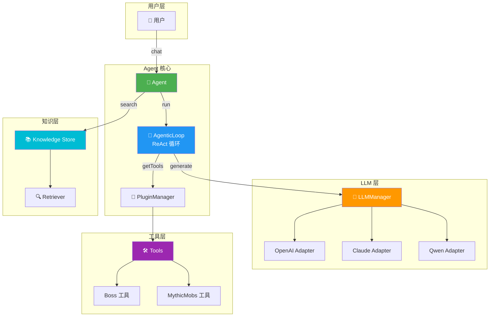

---

## 2. Tool 类型系统 (tool.ts)

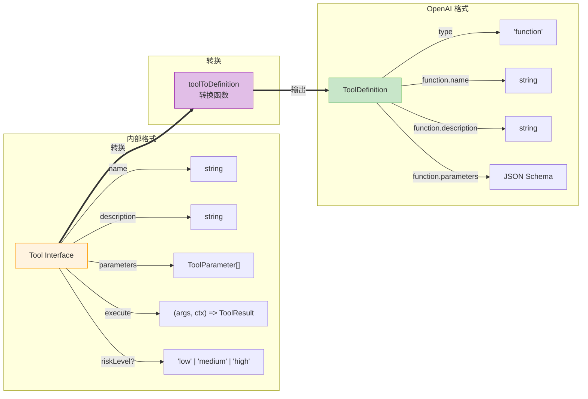

### ToolResult 结构

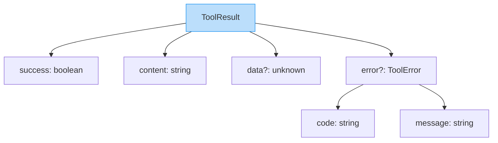

---

## 3. Response 类型系统 (response.ts)

```mermaid
graph TB
    subgraph "AgentResponse 联合类型"
        direction TB
        
        Execute[✅ ExecuteResponse<br/>执行完成]
        Clarify[❓ ClarifyResponse<br/>需要澄清]
        Confirm[⚠️ ConfirmResponse<br/>需要确认]
        Knowledge[📚 KnowledgeRequestResponse<br/>缺少知识]
        Options[📋 OptionsResponse<br/>提供选项]
    end
    
    Execute --> E1["message: string"]
    Execute --> E2["data?: unknown"]
    Execute --> E3["toolCalls?: ToolCallRecord[]"]
    
    Clarify --> C1["message: string"]
    Clarify --> C2["questions: string[]"]
    
    Confirm --> CF1["message: string"]
    Confirm --> CF2["action: {type, target, params}"]
    Confirm --> CF3["risk: 'low'|'medium'|'high'"]
    Confirm --> CF4["preview?: string"]
    
    Knowledge --> K1["message: string"]
    Knowledge --> K2["missing: {topic, description}"]
    Knowledge --> K3["options: KnowledgeOption[]"]
    
    Options --> O1["message: string"]
    Options --> O2["options: SelectableOption[]"]
    
    style Execute fill:#C8E6C9,stroke:#4CAF50
    style Clarify fill:#FFF9C4,stroke:#FFC107
    style Confirm fill:#FFCDD2,stroke:#F44336
    style Knowledge fill:#E1BEE7,stroke:#9C27B0
    style Options fill:#BBDEFB,stroke:#2196F3
```

### 场景示例

| 响应类型 | 触发场景 | 示例 |
|---------|---------|------|
| `execute` | 任务完成 | "已成功创建 Boss 刷新点" |
| `clarify` | 意图不明确 | "你要删除哪个 Boss？" |
| `confirm` | 高风险操作 | "确定要删除 FireDragon 吗？" |
| `knowledge_request` | 缺少信息 | "我不知道配置文件在哪里" |
| `options` | 多个选择 | "找到 3 个匹配的 Boss，请选择" |

---

## 4. Config 配置系统 (config.ts)

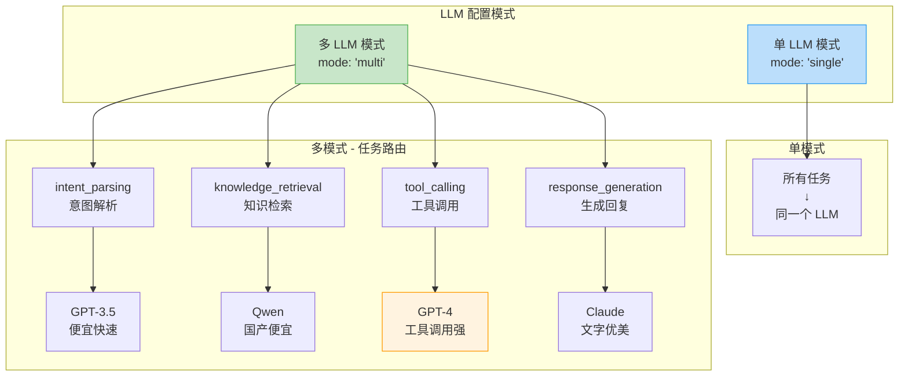

### 容错机制

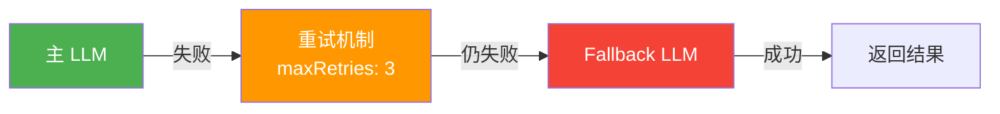

---

## 5. AgenticLoop 执行循环 (agentic-loop.ts)

### ReAct 模式

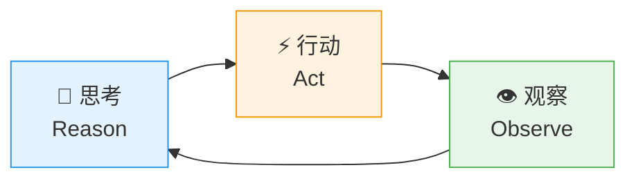

### 完整执行流程

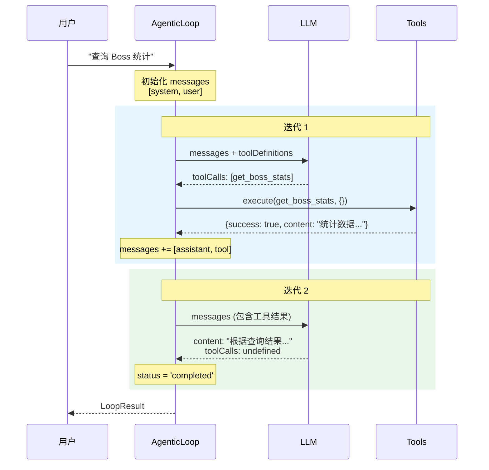

### Messages 状态变化

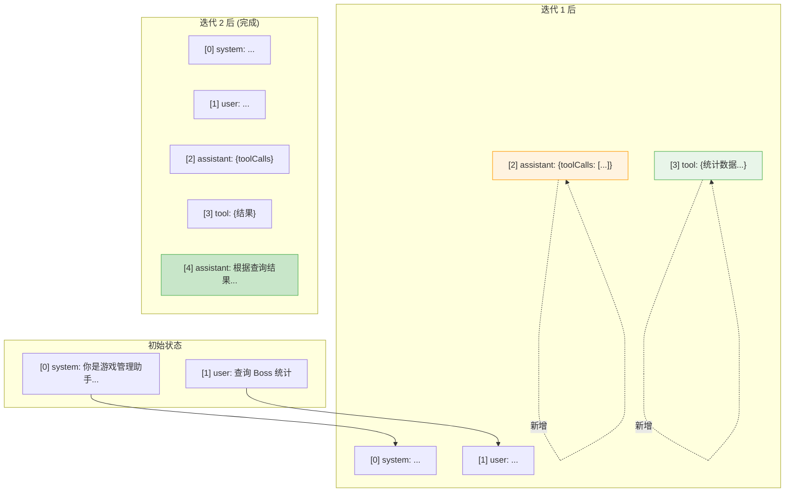

### 循环终止条件

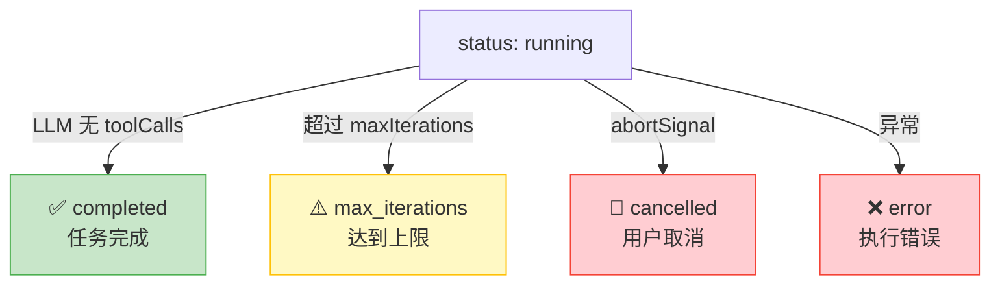

### 工具调用失败处理

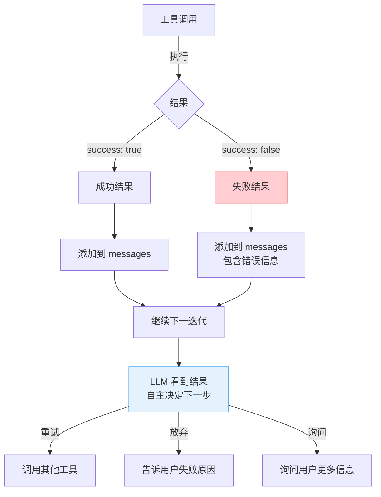

---

## 6. Day 1 知识点总结

### 核心概念

| 概念 | 文件 | 说明 |
|-----|------|------|
| Tool | `tool.ts` | 内部工具格式，包含 execute 函数 |
| ToolDefinition | `tool.ts` | OpenAI Function Calling 格式 |
| AgentResponse | `response.ts` | 5 种响应类型的联合类型 |
| LLMConfig | `config.ts` | 单/多 LLM 模式配置 |
| AgenticLoop | `agentic-loop.ts` | ReAct 执行循环 |

### 关键问题回答

1. **上下文如何维护？** → `state.messages` 数组累积所有消息
2. **怎么知道 LLM 想调用工具？** → 检查 `llmResponse.toolCalls`
3. **循环什么时候结束？** → LLM 不返回 `toolCalls` 时
4. **工具失败怎么办？** → 结果加入 messages，让 LLM 决定下一步

---

## 📖 如何查看这些图表

1. **VS Code**: 安装 "Markdown Preview Mermaid Support" 插件
2. **在线**: 复制 Mermaid 代码到 [mermaid.live](https://mermaid.live)
3. **导出**: 使用 mermaid-cli 导出为 PNG/SVG

```bash
# 安装 mermaid-cli
npm install -g @mermaid-js/mermaid-cli

# 导出为 PNG
mmdc -i ARCHITECTURE-DAY1.md -o architecture.png
```
